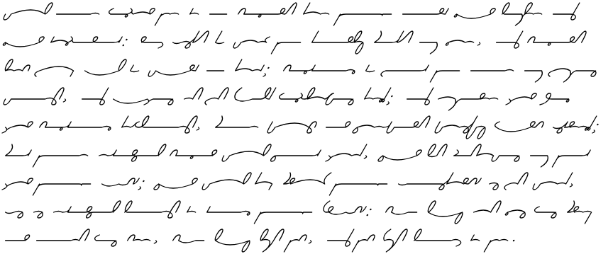

# Gutenberg to Grafoni Converter

This script downloads books from Project Gutenberg, converts them to Grafoni script, and generates PDFs of the converted text.
This is based on a Grafoni generator by Brent Werness; the original is here (http://github.com/Koloth/AutoGrafoni).


## Motivation

Grafoni (Hitlofi, 1913) is a sort of shorthand, but optimized more for fluent writing and readability than for pure speed. It
represents text purely phonetically, without the system of abbreviations that make shorthands like Gregg so
fast, and each character flows smoothly into the next with the junction always being on the central-line of
the writing.

To learn a writing system it's helpful to get fluent reading it, so you can recognize the
readability of your own output. This script allows you to create copious reading material for
practicing reading Grafoni.

I think Grafoni is attractive in print, and I like experimenting with different writing systems.
Here's a sample from Werness' project:



## Warning

This isn't working perfectly yet.  There's a lot of uninteresting front matter that's being parsed,
the formatting isn't yet perfected, and I haven't checked to see how punctuation is handled.

I'd like to pull this into Kindle to read, and it may be there are better formats than PDF.

## Features

- Downloads books from Project Gutenberg by title or book ID
- Converts English text to Grafoni phonetic script
- Generates multi-page PDFs with proper formatting
- Caches downloaded books for faster subsequent runs
- Supports various Project Gutenberg text formats
- Natural text wrapping with proportional heights
- Organized output directory structure

## Installation

1. Install the required dependencies:
```bash
pip install -r requirements.txt
```

2. Make sure you have the existing `grafoni.py` file in the same directory.

## Usage

### Basic Usage

Search for a book by title:
```bash
python gutenberg_to_grafoni.py "Pride and Prejudice"
```

Use a specific Project Gutenberg book ID:
```bash
python gutenberg_to_grafoni.py --book-id 1342
```

### Advanced Options

```bash
python gutenberg_to_grafoni.py "Alice in Wonderland" --output output/alice_grafoni.pdf --max-pages 20
```

### Command Line Arguments

- `title`: Book title to search for (optional if using --book-id)
- `--book-id`: Specific Project Gutenberg book ID
- `--output, -o`: Output PDF filename (default: output/grafoni_book.pdf)
- `--max-pages`: Maximum number of pages to generate (default: 50)

## Examples

### Convert "The Great Gatsby"
```bash
python gutenberg_to_grafoni.py "The Great Gatsby"
```

### Convert "1984" with custom output
```bash
python gutenberg_to_grafoni.py "1984" --output output/1984_grafoni.pdf --max-pages 30
```

### Convert a specific book by ID
```bash
python gutenberg_to_grafoni.py --book-id 64317 --output output/moby_dick_grafoni.pdf
```

## How It Works

1. **Book Search**: The script searches Project Gutenberg for books matching the title
2. **Book Download**: Downloads the book text in UTF-8 format
3. **Text Processing**: Cleans the text and splits it into sentences
4. **Grafoni Conversion**: Converts each sentence to Grafoni phonetic script with natural wrapping
5. **PDF Generation**: Creates a PDF with the Grafoni text, properly formatted

## File Structure

- `gutenberg_to_grafoni.py`: Main conversion script
- `grafoni.py`: Existing Grafoni conversion library
- `grafoni_utils.py`: Utility functions for Grafoni conversion
- `requirements.txt`: Python dependencies
- `gutenberg_cache/`: Directory for caching downloaded books
- `output/`: Directory containing all generated PDFs and test files

## Text Wrapping

The script uses intelligent text wrapping that:
- Wraps text at natural word boundaries
- Maintains proportional heights (longer sentences = taller images)
- Preserves aspect ratios without horizontal scaling
- Uses consistent line spacing for readability

## Troubleshooting

### Common Issues

1. **Book not found**: Try using a more specific title or use the book ID directly
2. **Conversion errors**: Some books may have formatting issues that cause conversion problems
3. **PDF generation fails**: Make sure all dependencies are installed correctly

### Dependencies

The script requires:
- `drawsvg`: For SVG generation
- `eng_to_ipa`: For phonetic conversion
- `requests`: For downloading books
- `reportlab`: For PDF generation
- `cairosvg`: For SVG to PNG conversion

## Notes

- The script caches downloaded books in the `gutenberg_cache/` directory
- All generated PDFs are saved to the `output/` directory
- Large books may take a while to process
- The quality of conversion depends on the text quality from Project Gutenberg
- Some books may have formatting issues that affect the conversion
- Text wrapping is optimized for readability with natural line breaks

## To Do
- Text wrapping doesn't currently play well with placement in the PDF, so the
  scale gets all wonky.
- Consider different punctuation handling


## License

This script is provided as-is for educational and personal use. 

## References

Hitlofi, Iven (1913). "Complete ELementary Instructor in Grafoni: A New Phonography; A World-Shorthand". https://drive.google.com/file/d/1HzReKI8w2_57kkeVKwTHKKghNFOSosEn/view