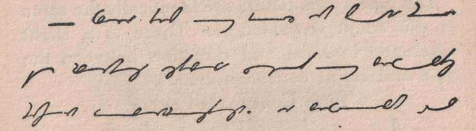

# Gutenberg to Grafoni Converter

This script downloads books from Project Gutenberg, converts them to Grafoni script, and generates PDFs of the converted text.
This is based on a Grafoni generator by Brent Werness; the original is here (http://github.com/Koloth/AutoGrafoni).

## Motivation

Grafoni (Hitlofi, 1913) is a sort of shorthand, but optimized more for fluent writing and readability than for pure speed. It
represents text purely phonetically, without the system of abbreviations that make shorthands like Gregg so
fast, and each character flows smoothly into the next with the junction always being on the central-line of
the writing.

To learn a writing system it's helpful to get fluent reading it, so you can recognize the
readability of your own output. This script allows you to create copious reading material for
practicing reading Grafoni.

I think Grafoni is attractive in print, and I like experimenting with different writing systems.
Here's a sample from Hitlofi's book:



and from Werness' generator, which I think captures the spirit of it well:


## A note on "vibe coding"

This project was also a test case for playing with Cursor.  A lot of the code was AI generated,
and it did a surprising amount on its own with little steering. However with the font sizing issue, 
the AI simply couldn't reason clearly about sizes, scaling, and line wrapping; I had to fix this by hand.  

But I see a serious problem that AI coding still needs to overcome -- there's a lot of code here that I hadn't read yet, so it 
took me a bit to figure out how it worked to fix this problem. It's a little like the
mostly-self-driving cars that make you keep your hands on the wheel so you are mentally ready to
take over in case of an emergency -- but cursor only kept me engaged on
a superficial/architectural level. So now there's serious mental ramp-up needed for me to take over
and fix something by hand.

## Warning

This isn't perfect yet.  Some punctuation is missing, like quotes, !, and ?; but it's pretty 
good and pretty readable.

I'd like to pull this into Kindle to read, and it may be there are better formats than PDF.

## Features

- Downloads books from Project Gutenberg by title or book ID
- Converts English text to Grafoni phonetic script
- Generates multi-page PDFs with proper formatting
- Caches downloaded books for faster subsequent runs
- Supports various Project Gutenberg text formats
- Natural text wrapping with proportional heights
- Organized output directory structure

## Installation

1. Install the required dependencies:
```bash
pip install -r requirements.txt
```

## Usage

### Basic Usage

Search for a book by title:
```bash
python gutenberg_to_grafoni.py "Pride and Prejudice"
```

Use a specific Project Gutenberg book ID:
```bash
python gutenberg_to_grafoni.py --book-id 1342
```

### Advanced Options

```bash
python gutenberg_to_grafoni.py "Alice in Wonderland" --output output/alice_grafoni.pdf --max-pages 20
```

### Command Line Arguments

- `title`: Book title to search for (optional if using --book-id)
- `--book-id`: Specific Project Gutenberg book ID
- `--output, -o`: Output PDF filename (default: output/grafoni_book.pdf)
- `--max-pages`: Maximum number of pages to generate (default: 50000)

## Examples

### Convert "The Great Gatsby"
```bash
python gutenberg_to_grafoni.py "The Great Gatsby"
```

### Convert "1984" with custom output
```bash
python gutenberg_to_grafoni.py "1984" --output output/1984_grafoni.pdf --max-pages 30
```

### Convert a specific book by ID
```bash
python gutenberg_to_grafoni.py --book-id 64317 --output output/moby_dick_grafoni.pdf
```

## How It Works

1. **Book Search**: The script searches Project Gutenberg for books matching the title
2. **Book Download**: Downloads the book text in UTF-8 format
3. **Text Processing**: Cleans the text and splits it into paragraph
4. **Grafoni Conversion**: Converts each paragraph to IPA and thence to Grafoni phonetic script in SVGs
5. **PDF Generation**: Creates a PDF with the SVGs pasted one after the next

## File Structure

- `gutenberg_to_grafoni.py`: Main conversion script
- `grafoni.py`: Existing Grafoni conversion library
- `grafoni_utils.py`: Utility functions for Grafoni conversion
- `requirements.txt`: Python dependencies
- `gutenberg_cache/`: Directory for caching downloaded books
- `output/`: Directory containing all generated PDFs and test files

## Troubleshooting


### Dependencies

The script requires:
- `drawsvg`: For SVG generation
- `eng_to_ipa`: For phonetic conversion
- `requests`: For downloading books
- `reportlab`: For PDF generation
- `cairosvg`: For SVG to PNG conversion

## Notes

- The script caches downloaded books in the `gutenberg_cache/` directory
- All generated PDFs are saved to the `output/` directory

## License

This script is provided as-is for educational and personal use. 

## References

Hitlofi, Iven (1913). "Complete Elementary Instructor in Grafoni: A New Phonography; A World-Shorthand". https://drive.google.com/file/d/1HzReKI8w2_57kkeVKwTHKKghNFOSosEn/view